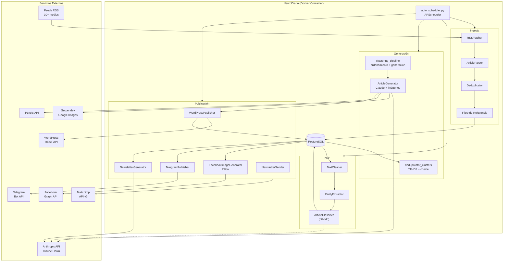
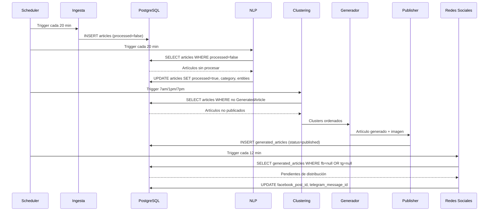

# Arquitectura de NeuroDiario

## Visión General

NeuroDiario es un sistema de periodismo autónomo que opera como un pipeline de procesamiento de datos de cinco etapas: ingesta, procesamiento NLP, generación de contenido, publicación y distribución. El sistema corre como un proceso Docker persistente en Railway, orquestado por APScheduler.

## Diagrama de Componentes

## Comunicación entre Componentes

Los módulos se comunican a través de la base de datos PostgreSQL como intermediario principal:

## Principios de Diseño

1. **Modularidad**: cada fase del pipeline es independiente y ejecutable por separado.
2. **Carga perezosa**: los modelos pesados (spaCy, sentence-transformers) se inicializan solo cuando se necesitan.
3. **BD como bus de datos**: los módulos no se llaman entre sí directamente; la BD actúa como cola de trabajo.
4. **Fallbacks en cascada**: cada integración externa tiene alternativas (newspaper3k → BS4, Serper → Pexels, sendPhoto → sendMessage).
5. **Distribución escalonada**: un artículo por ciclo en redes sociales para evitar saturación.
6. **Dry-run por defecto**: todas las operaciones destructivas requieren confirmación explícita.

## Infraestructura

| Componente | Servicio | Detalles |
|-----------|---------|---------|
| Aplicación | Railway Pro | Docker container con Python 3.11-slim |
| Base de datos | Railway PostgreSQL | Gestionada, pool_size=5, max_overflow=10 |
| CMS | GreenGeeks | WordPress (PHP 8.2), REST API habilitada |
| CDN de imágenes | WordPress Media Library | Subida vía REST API |
| Código fuente | GitHub | Autodeploy a Railway en push a main |
