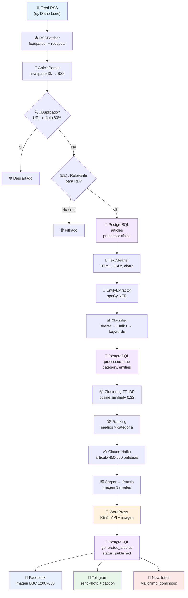

# Flujo de Datos

## Viaje de una Noticia

## Transformaciones de Datos

| Etapa | Entrada | Transformación | Salida |
|-------|---------|---------------|--------|
| RSS | Feed XML | Parseo + normalización | Dict: title, url, summary, source, image |
| Parse | Dict con URL | Descarga HTML → extracción de texto | + raw_html, raw_content, word_count |
| Dedup | URL + título | Comparación exacta + SequenceMatcher | Booleano (pasa/no pasa) |
| Filtro | Dict completo | Keywords RD en título + contenido | Booleano (pasa/no pasa) |
| Clean | raw_content | Regex: HTML, URLs, emails, chars | clean_content |
| NER | clean_content | spaCy pipeline | entities: {persona: [], org: [], lugar: []} |
| Classify | texto + título + fuente | Híbrido 3 capas | (categoría, confianza) |
| Cluster | título + summary | TF-IDF + cosine similarity | Clusters de artículos similares |
| Generar | Cluster de artículos | Claude Haiku + system prompt | Artículo HTML + footer + compartir |
| Imagen | Título + categoría | Claude query → Serper → Pexels | URL de imagen + HTML |
| Publicar | Artículo + imagen | WordPress REST API | wordpress_post_id |
| Facebook | Título + imagen + URL | Pillow compositing + Graph API | facebook_post_id |
| Telegram | Título + imagen + URL | Bot API sendPhoto | telegram_message_id |
