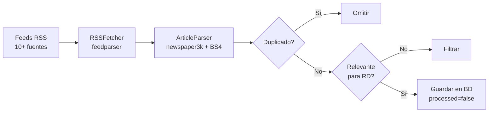

# Pipeline de NeuroDiario

## Descripción General

El pipeline opera en cinco fases automatizadas que transforman noticias de feeds RSS en artículos publicados con distribución multi-canal.

## Fase 1: Ingesta RSS

**Frecuencia**: cada 20 minutos  
**Módulo**: `neurodiario.scheduler.pipeline.run_ingestion_pipeline()`

1. `RSSFetcher.fetch_articles()` itera sobre las fuentes activas en `sources_config.py`
2. Descarga cada feed con headers de browser (User-Agent de Chrome)
3. Normaliza cada entrada: título, URL, resumen, fecha, fuente, imagen
4. `ArticleParser.parse()` descarga el HTML completo usando newspaper3k (fallback a requests + BeautifulSoup)
5. `is_duplicate()` verifica por URL exacta y similitud de título (umbral 0.80)
6. `es_relevante_para_rd()` filtra internacionales: fuentes dominicanas siempre pasan, internacionales solo si contienen keywords relevantes para RD
7. Guarda separando dominicanas primero, luego internacionales relevantes
8. La función `save_article()` resuelve automáticamente el `source_id` (crea el Source si no existe)

## Fase 2: Procesamiento NLP

**Frecuencia**: cada 20 minutos  
**Módulo**: `neurodiario.scheduler.nlp_pipeline.run_nlp_pipeline()`

1. `get_unprocessed_articles(limit=50)` obtiene artículos con `processed=False`
2. `TextCleaner.clean_text()` elimina HTML, URLs, emails, caracteres especiales
3. `TextCleaner.get_summary()` genera resumen automático (primeras 3 oraciones) si no hay uno del RSS
4. `EntityExtractor.extract_entities()` extrae personas, organizaciones, lugares con spaCy `es_core_news_lg`
5. `ArticleClassifier.classify_article()` asigna categoría con enfoque híbrido:
   - Si la fuente tiene categoría específica confiable (deportes, economía, etc.) → la usa directamente
   - Si es genérica (general, internacional) → consulta a Claude Haiku
   - Si Haiku falla → fallback a keywords con regex y límites de palabra
6. Persiste resultados y marca `processed=True`

## Fase 3: Clustering y Generación

**Frecuencia**: 7:00, 13:00, 19:00 (América/Santo_Domingo)  
**Módulo**: `clustering_pipeline.procesar(publicar=True)`

1. `_cargar_articulos(24)` lee artículos de las últimas 24h que no tienen `GeneratedArticle`
2. `_agrupar()` vectoriza título+resumen con TF-IDF (stopwords en español, bigramas) y agrupa por cosine similarity (umbral 0.32). Tope de seguridad: clusters > 8 se desarman.
3. `_ordenar_clusters()` ordena por: más medios distintos primero → prioridad de categoría (política > sociedad > economía...) → clusters más grandes
4. Selecciona los mejores 25 clusters
5. Para cada cluster, lee el `raw_content` de sus artículos
6. `ArticleGenerator.create_article()` llama a Claude Haiku para sintetizar las fuentes en un artículo original de 450-650 palabras
7. Busca imagen con la estrategia de 3 niveles (oficial → Google general → Pexels)
8. Construye footer con atribución a fuentes + botones de compartir (Facebook, X, WhatsApp, RSS)

## Fase 4: Publicación en WordPress

**Módulo**: `neurodiario.publisher.wordpress_publisher.WordPressPublisher`

1. Descarga la imagen y la sube a WordPress Media Library (`POST /wp-json/wp/v2/media`)
2. Crea o busca categorías vía REST API (`GET/POST /wp-json/wp/v2/categories`)
3. Crea o busca tags (`GET/POST /wp-json/wp/v2/tags`)
4. Publica el post con `featured_media`, categorías, tags y status=`publish` (`POST /wp-json/wp/v2/posts`)
5. Registra el `GeneratedArticle` en la BD con status=`published` y `wordpress_post_id`
6. Marca los demás artículos del cluster como `clustered` (excluidos de futuros ciclos)

## Fase 5: Distribución Social

**Frecuencia**: cada 12 minutos (escalonado: 1 artículo por ciclo)  
**Módulo**: `scheduler.auto_scheduler._job_social_sync()`

1. Busca `GeneratedArticle` con status=`published` y `wordpress_post_id` no nulo, donde `facebook_post_id` o `telegram_message_id` sean nulos
2. Toma solo el primer pendiente de la cola
3. Verifica que el post de WordPress esté realmente en status `publish`
4. Recolecta URLs de imagen candidatas (BD + WordPress featured image)
5. **Facebook**: genera imagen 1200×630 con Pillow (foto + overlay + título + barra de marca) → publica vía Graph API `/photos`
6. **Telegram**: publica con `sendPhoto` (fallback a `sendMessage`)
7. Registra `facebook_post_id` y `telegram_message_id` en BD
